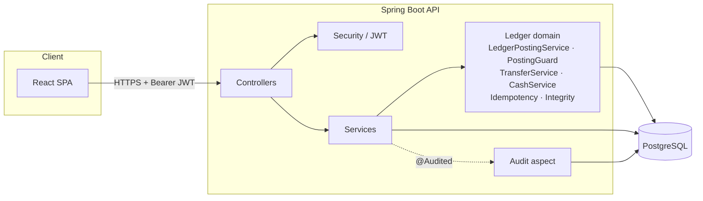

# Penny

A production-oriented, double-entry transaction ledger for digital banking. The
core problem this project solves is **correct money movement**, not account
management — every transfer is modeled the way a real bank's core ledger
models it: as a balanced pair of debit and credit postings to an append-only
ledger, with balances that are always *derived*, never stored.

Built as a portfolio-grade demonstration of backend engineering for financial
systems: correctness under concurrency, transactional idempotency, an
immutable audit trail, and role-based access control, all backed by real
integration tests against PostgreSQL (no H2, no mocked database).

---

## Table of contents

- [Why this project exists](#why-this-project-exists)
- [Architecture](#architecture)
- [Tech stack](#tech-stack)
- [Folder structure](#folder-structure)
- [Database schema](#database-schema)
- [Core correctness guarantees](#core-correctness-guarantees)
- [API examples](#api-examples)
- [Running locally](#running-locally)
- [Docker](#docker)
- [Design system](#design-system)
- [Testing](#testing)
- [CI/CD](#cicd)
- [Deployment](#deployment)
- [Screenshots](#screenshots)
- [Future improvements](#future-improvements)

---

## Why this project exists

Most portfolio banking apps are CRUD wrappers around an `accounts` table with
a `balance` column that gets mutated in place. That approach cannot answer
the question a real bank must always be able to answer: *prove that no money
was created or destroyed.*

Penny is built around the opposite constraint: **accounts never carry a
balance column at all.** A balance is always `SUM(credits) - SUM(debits)`
over an append-only ledger, computed by a database view. Every posting writes
exactly one debit and one credit of equal amount in a single transaction, so
the invariant `total debits == total credits` holds by construction, not by a
nightly reconciliation job.

That applies to money *entering* the system too. A deposit is not a one-sided
credit — it debits a bank-owned cash vault and credits the customer, because
double-entry forbids a posting with a single leg. That choice buys a stronger,
directly checkable property: **the sum of every account balance in the system
is always exactly zero**, which is what makes "was money created anywhere?"
answerable with one query. `GET /ledger/integrity` asserts it.

## Architecture

Clean/hexagonal layering — controllers hold no business logic, services own
authorization and orchestration, the ledger package owns the one piece of
the domain that must never be wrong.



**Layers**

| Package | Responsibility |
|---|---|
| `controller` | HTTP boundary only — binds requests, delegates, maps responses. No `if (role == ...)` here. |
| `service` | Business orchestration for users/accounts; owns `@PreAuthorize` role checks. |
| `ledger` | The double-entry domain: `LedgerPostingService` (the only writer of ledger entries), `PostingGuard` (locking + the preconditions every posting shares), `TransferService`, `CashService` (deposits/withdrawals), `IdempotencyService` + `IdempotencyClaimStore`, `TransactionHistoryService`, `LedgerIntegrityService`. |
| `domain` | Immutable Spring Data JDBC records — no anemic setters, no Hibernate magic. |
| `security` | JWT issuance/validation, `UserPrincipal`, `AccountAccessGuard` (ownership checks used in `@PreAuthorize` SpEL). |
| `audit` | `@Audited` annotation + one AOP aspect that writes `audit_log` rows — declarative, not scattered through services. |
| `dto` / `mapper` | Request/response shapes and domain↔DTO translation. |
| `exception` | Typed domain exceptions, each owning its HTTP status, plus a global handler for a consistent error contract. |
| `repository` | Spring Data JDBC repositories — thin, no query logic beyond what SQL/derived-query naming expresses. |

## Tech stack

**Backend** — Java 17 · Spring Boot 3 · Spring Web · Spring Security · Spring
Validation · Spring Data JDBC (not JPA/Hibernate) · PostgreSQL · Flyway · JWT
· springdoc-openapi (Swagger UI) · Docker

**Frontend** — React 19 · TypeScript · Vite · Tailwind CSS v4 · Axios ·
React Router · SF Pro (system font), light appearance only

**Testing** — JUnit 5 · MockMvc · Testcontainers (real PostgreSQL, no H2) ·
Mockito · JaCoCo (85% coverage gate)

**Deployment** — Backend: Render/Fly.io · Database: Neon PostgreSQL ·
Frontend: Netlify · CI/CD: GitHub Actions

## Folder structure

```
penny/
├── backend/
│   ├── src/main/java/com/penny/
│   │   ├── audit/          # @Audited annotation + AOP aspect, RequestIdFilter
│   │   ├── config/         # SecurityConfig, OpenApiConfig, property binding
│   │   ├── controller/     # REST controllers (thin)
│   │   ├── domain/         # Immutable records: User, Account, LedgerEntry, ...
│   │   ├── dto/             # Request/response DTOs
│   │   ├── exception/      # Typed exceptions + GlobalExceptionHandler
│   │   ├── ledger/          # Double-entry domain: posting, locking, cash, idempotency, integrity
│   │   ├── mapper/          # Domain <-> DTO mapping
│   │   ├── repository/     # Spring Data JDBC repositories
│   │   ├── security/        # JWT, filters, UserPrincipal, AccountAccessGuard
│   │   └── service/         # UserService, AccountService, AuthService
│   ├── src/main/resources/db/migration/  # Flyway migrations V1-V6
│   └── src/test/java/com/penny/     # Unit + Testcontainers integration tests
├── frontend/
│   └── src/
│       ├── api/             # axios client, JWT refresh interceptor, endpoints, types
│       ├── auth/             # AuthContext, route guards
│       ├── components/ui/   # Design-system primitives (List, Button, Field, Sheet, Toast...)
│       ├── lib/              # Money parsing + formatting, useAsync, cn
│       └── pages/            # Login, Overview, Accounts, Activity, Transfer, People, Audit
├── scripts/seed-demo.sh      # Seeds demo data through the public API (no SQL)
├── .github/workflows/ci.yml
├── docker-compose.yml
└── README.md
```

## Database schema


`account_balances` is a **database view**, not a table:

```sql
CREATE VIEW account_balances AS
SELECT
    a.id AS account_id,
    a.account_number,
    COALESCE(SUM(CASE WHEN le.entry_type = 'CREDIT' THEN le.amount_minor_units ELSE 0 END), 0)
        - COALESCE(SUM(CASE WHEN le.entry_type = 'DEBIT' THEN le.amount_minor_units ELSE 0 END), 0)
        AS balance_minor_units
FROM accounts a
LEFT JOIN ledger_entries le ON le.account_id = a.id
GROUP BY a.id, a.account_number;
```

`ledger_entries` and `audit_log` are append-only **at the database level** —
`BEFORE UPDATE`/`BEFORE DELETE` triggers reject any mutation, regardless of
whether it comes from application code, a migration, or a human at a `psql`
prompt.

Money is always `BIGINT` minor units (cents/paise) — never `float`/`double`.

## Core correctness guarantees

| Guarantee | How it's enforced |
|---|---|
| Debits always equal credits | `LedgerPostingService.post()` is the only method that writes `ledger_entries`, and it always writes one DEBIT + one CREDIT of equal amount in one DB transaction. |
| Balances can't drift from postings | `account_balances` is a view — there is no mutable balance column to fall out of sync. |
| No double-spend under concurrency | Both accounts are locked with `SELECT ... FOR UPDATE`, always in ascending account-id order (to prevent deadlocks between opposite-direction transfers), before the balance is re-read. Proven by `ConcurrentTransferIT`: 50 parallel transfers against an account that can only afford 10 — exactly 10 succeed, balance lands at exactly 0. |
| A request retried with the same `Idempotency-Key` never moves money twice | The key claim runs on a Postgres **SAVEPOINT** (`Propagation.NESTED`) inside the transfer's own transaction — the claim and the ledger postings commit or roll back together atomically. |
| The ledger can't be edited or deleted after the fact | `ledger_entries` and `audit_log` reject `UPDATE`/`DELETE` via DB triggers. |
| Every state-changing action is attributable | `@Audited` + one AOP aspect records actor, action, entity, request ID, and IP for every write, in the same transaction as the change. |
| Money cannot be created or destroyed | Deposits and withdrawals post against a bank-owned cash vault rather than crediting an account from nothing, so every account balance summed together is exactly zero. `GET /ledger/integrity` re-derives the totals straight from `ledger_entries` (not the balances view, so it is a genuine cross-check) and asserts it. |
| A customer cannot mint balance via the vault | Transfers explicitly reject system accounts. The vault is permitted to run negative; without that guard a customer could "transfer" from it. |
| A closed account cannot strand funds | Closing is terminal and is refused while the account still holds a balance. |

## API examples

All endpoints are documented interactively at `/swagger-ui.html` once the
backend is running. A few representative calls:

**Login**

```bash
curl -X POST http://localhost:8080/auth/login \
  -H 'Content-Type: application/json' \
  -d '{"username": "admin", "password": "Admin@12345"}'
```

```json
{
  "accessToken": "eyJhbGciOi...",
  "refreshToken": "sxp8Ly8Yov5...",
  "expiresInSeconds": 900,
  "tokenType": "Bearer"
}
```

**Transfer money (idempotent)**

```bash
curl -X POST http://localhost:8080/transfers \
  -H "Authorization: Bearer $ACCESS_TOKEN" \
  -H "Idempotency-Key: 6c1f9e2a-8b2e-4b7a-9a0e-4a2f1e2b3c4d" \
  -H 'Content-Type: application/json' \
  -d '{
        "sourceAccountId": 1,
        "destinationAccountId": 2,
        "amountMinorUnits": 5000,
        "reference": "July rent"
      }'
```

```json
{
  "transactionId": 42,
  "sourceAccountId": 1,
  "destinationAccountId": 2,
  "amountMinorUnits": 5000,
  "reference": "July rent",
  "createdAt": "2026-07-28T12:00:00Z"
}
```

Replaying the exact same request with the same `Idempotency-Key` returns the
same response body without posting a second pair of ledger entries. The same
key with a *different* payload is rejected with `409 Conflict`.

**Deposit cash (staff only)**

Money entering the ledger still posts two legs — the vault is debited, the
customer credited.

```bash
curl -X POST http://localhost:8080/accounts/2/deposit \
  -H "Authorization: Bearer $ACCESS_TOKEN" \
  -H "Idempotency-Key: $(uuidgen)" \
  -H 'Content-Type: application/json' \
  -d '{"amountMinorUnits": 25000, "reference": "Counter deposit"}'
```

```json
{
  "transactionId": 8,
  "transactionType": "DEPOSIT",
  "accountId": 2,
  "amountMinorUnits": 25000,
  "resultingBalanceMinorUnits": 389575,
  "reference": "Counter deposit",
  "createdAt": "2026-08-25T10:41:12Z"
}
```

**Prove the books balance**

```bash
curl http://localhost:8080/ledger/integrity -H "Authorization: Bearer $ACCESS_TOKEN"
```

```json
{
  "balanced": true,
  "totalDebitsMinorUnits": 2109575,
  "totalCreditsMinorUnits": 2109575,
  "netAcrossAllAccountsMinorUnits": 0,
  "ledgerEntryCount": 16
}
```

`netAcrossAllAccountsMinorUnits` is zero because the vault holds the exact
negative of everything on deposit. If a balance were ever conjured without a
matching debit, this would be non-zero.

**Paged transaction history**

A CUSTOMER's results are narrowed in SQL to transactions touching their own
accounts, so pages stay full and totals do not leak other customers' activity.

```bash
curl "http://localhost:8080/transfers?page=0&size=20" -H "Authorization: Bearer $ACCESS_TOKEN"
```

**Freeze or close an account (ADMIN only)**

```bash
curl -X PATCH http://localhost:8080/accounts/2/status \
  -H "Authorization: Bearer $ACCESS_TOKEN" \
  -H 'Content-Type: application/json' \
  -d '{"status": "INACTIVE"}'
```

`CLOSED` is terminal, and closing is refused while the account still holds a
balance — otherwise the funds would be stranded on the books but unreachable.

**View an account's ledger**

```bash
curl http://localhost:8080/ledger/1 -H "Authorization: Bearer $ACCESS_TOKEN"
```

## Running locally

### Prerequisites

- Java 17+ (JaCoCo's bundled ASM does not yet support class files from
  JDKs newer than ~22 — if `mvn verify` fails with an
  `IllegalArgumentException: Unsupported class file major version`, point
  `JAVA_HOME` at a JDK in the 17–22 range)
- Node 20+
- Docker (for PostgreSQL, or the full stack)

> If you already run PostgreSQL locally it will occupy port 5432 and silently
> shadow the container, surfacing as a confusing `role "penny" does not
> exist`. Start the stack on another port instead:
> `POSTGRES_HOST_PORT=5433 docker compose up -d postgres`, and point the app at
> it with `DB_URL=jdbc:postgresql://localhost:5433/penny`.

### Backend

```bash
docker compose up -d postgres
cd backend
mvn spring-boot:run
```

The API is now at `http://localhost:8080`, Swagger UI at
`http://localhost:8080/swagger-ui.html`. Flyway migrates the schema
automatically on startup — there is no manual migration step.

### Frontend

```bash
cd frontend
cp .env.example .env.local
npm install
npm run dev
```

The app is now at `http://localhost:5173`.

### Seeding demo data

There is no public registration endpoint — in a bank, accounts are not
self-service. One script sets up everything else:

```bash
./scripts/seed-demo.sh
```

It creates a teller, an auditor and two customers, opens their accounts, funds
them, posts a few transfers, and finishes by asserting the ledger balances.
Every step goes through the public API, including the opening balances, which
are posted as real deposits against the cash vault. **There is deliberately no
SQL in it** — hand-inserting a balance produces a single-legged credit that
creates money from nothing, which `GET /ledger/integrity` will then correctly
report as unbalanced.

The one exception is the very first admin row, since creating a user requires
already being an admin.

Sign in with any of:

| Username | Password | Sees |
|---|---|---|
| `admin` | `Admin@12345` | Everything, including account status and user management |
| `tom_teller` | `Password123!` | Opens accounts, moves money, records cash |
| `amy_auditor` | `Password123!` | Read-only, including the audit trail |
| `jane_customer` | `Password123!` | Only her own accounts and transfers |

## Docker

The full stack — Postgres, backend, frontend — starts with one command:

```bash
docker compose up --build
```

- Frontend: `http://localhost:5173`
- Backend: `http://localhost:8080`
- Postgres: `localhost:5432`

Each service has a health check; `docker compose ps` shows readiness.

## Design system

The interface is built in Apple's design language — the reference is Wallet,
Apple Card and Apple Pay rather than a generic dashboard. **Light appearance
only.** Tokens live in `frontend/src/index.css`; primitives in
`frontend/src/components/ui/`.

What that means concretely:

- **A grouped background with white cards floating on it.** The page is
  `#F2F2F7` and content sits on white above it. That inversion — grey page,
  white content — is most of what makes a layout read as iOS rather than as a
  web page with boxes drawn on it.
- **Inset grouped lists as the primary structure.** Rounded white containers
  whose rows divide with a hairline that *starts at the row's text*, not at the
  card edge. That inset is the single most recognisable detail of an iOS list,
  and it is why the app doesn't read as a striped table.
- **SF Pro at Apple's own sizes, weights and tracking.** Tracking is
  size-specific and tightens as text grows: `-0.030em` at 34px, `0` at 12px,
  slightly positive at 11px. One global `letter-spacing` is wrong at one end or
  the other.
- **Tabular figures for every amount.** Without them digits jitter and column
  edges wobble as values change.
- **The card as hero.** Account and total screens lead with a card carrying the
  balance at display size, because that is the one thing the person came to
  find out.
- **Sheets, not dialogs.** Modals rise from the bottom edge with a grabber on
  small screens and become a centred card on large ones, dimming and receding
  the page behind them.
- **Feedback on pointer-down.** Controls scale to 0.97 over 100ms on `:active`.
  Waiting for the click to acknowledge a press is what makes an interface feel
  dead.
- **Three button weights, used with restraint** — filled, tinted, plain. One
  filled blue button per screen: if everything is primary, nothing is.

### A note on Apple's colours and contrast

Apple's `systemBlue` (`#007AFF`) measures **3.60:1** as text on the grouped
background and **4.02:1** with white on top of it — it misses WCAG AA in both
directions. Apple can lean on their own system accessibility settings; a
browser app cannot. So the palette uses the closest blue to systemBlue that
clears 4.5:1 *both* ways, and `systemGreen` and the secondary label greys get
the same treatment.

Every foreground/background pair was measured in-browser rather than assumed:

| Token | On grouped background |
|---|---|
| `--label` | 18.8 |
| `--label-secondary` | 6.4 |
| `--label-tertiary` | 4.5 |
| `--blue` | 4.6 |
| `--green` | 5.2 |
| `--red` | 4.8 |
| `--orange` | 4.7 |
| white on blue fill | 5.1 |

The `*-fill` variants keep their full-strength system values, because they only
ever sit behind a white glyph and never carry text.

Beyond colour: `:focus-visible` is defined globally as a soft blue halo, focus
is trapped and restored in sheets, and `prefers-reduced-motion`,
`prefers-reduced-transparency` and `prefers-contrast` each have real handling
rather than being ignored.

## Testing

```bash
cd backend
mvn verify
```

This runs unit tests, Testcontainers-backed integration tests (a real
PostgreSQL container per test run — no H2), generates a JaCoCo coverage
report at `target/site/jacoco/index.html`, and enforces an 85% instruction
coverage gate.

43 tests, 92% instruction coverage. Notable ones:

- `ConcurrentTransferIT` — 50 concurrent transfers proving the pessimistic
  lock closes the double-spend race: exactly 10 succeed against a balance that
  affords 10, and the account lands on exactly zero
- `CashOperationsIT` — deposits and withdrawals, including an assertion that
  the ledger still balances afterwards
- `IdempotencyIT` — replay-safety, cross-payload conflict detection, and that a
  *failed* operation releases its key for a legitimate retry
- `AccountLifecycleIT` — status transitions, that a frozen account rejects
  transfers, that closing is terminal, and that an account holding money cannot
  be closed
- `TransactionHistoryIT` — paging plus the SQL-level access filter, including
  that one customer cannot page through another's activity
- `AuthControllerIT`, `AccountControllerIT`, `TransferControllerIT`,
  `AuditControllerIT`, `UserControllerIT` — MockMvc + Testcontainers,
  exercising the full filter chain including JWT auth and role checks

Test fixtures fund accounts through the real deposit endpoint rather than
inserting ledger rows. An earlier version seeded balances with a lone CREDIT,
which creates money from nothing — the tests were asserting against a state the
production code could never actually produce.

## CI/CD

`.github/workflows/ci.yml` runs on every pull request and push to `main`:

1. **Backend** — `mvn verify` (build, unit + integration tests, coverage report), uploads JaCoCo + surefire/failsafe reports as artifacts
2. **Frontend** — type-check, build, lint
3. **Docker** — builds both images to catch Dockerfile regressions, gated on the first two jobs passing

## Deployment

| Component | Target | Notes |
|---|---|---|
| Backend | Render or Fly.io | Deploy the `backend/Dockerfile` image; set `DB_URL`, `DB_USERNAME`, `DB_PASSWORD`, `JWT_SECRET` as environment variables. |
| Database | [Neon](https://neon.tech) PostgreSQL | Serverless Postgres; Flyway migrates on backend startup, no manual step. |
| Frontend | Netlify | Build command `npm run build`, publish directory `dist`, set `VITE_API_BASE_URL` to the deployed backend URL. |

## Screenshots

> _Placeholder — add screenshots of the Dashboard, Transfer flow, Ledger
> viewer, and Audit log here before sharing publicly._

## Future improvements

- **Refresh tokens in an httpOnly cookie.** They currently live in
  `localStorage` on the frontend for demo simplicity — readable by any
  script on the page. A production deployment should move the refresh
  token to an httpOnly, `SameSite=Strict` cookie and keep only the access
  token in memory.
- **Multi-currency transfers with FX conversion.** An account carries a
  currency, but a transfer currently assumes both sides match and does not
  enforce it — cross-currency movement needs a rate-locking step recorded on
  the transaction, and until that exists the API should reject mismatched
  pairs outright.
- **Pagination on the audit log and account list.** Transaction history is
  paged; those two still return everything.
- **Outbox pattern for downstream events.** Publishing `TransferCompleted`
  events (e.g. to notify a fraud-detection service) reliably would need an
  outbox table written in the same transaction as the ledger entries.
- **Rate limiting** on `/auth/login` and `/transfers` to blunt brute-force
  and abuse.
- **Scheduled reconciliation.** `GET /ledger/integrity` performs this check on
  demand; running it on a schedule and alerting on failure would catch drift
  without someone having to look.
- **OpenTelemetry tracing** across the request → service → DB path, since
  `request_id` is already threaded through the audit log and would pair
  naturally with a trace ID.
