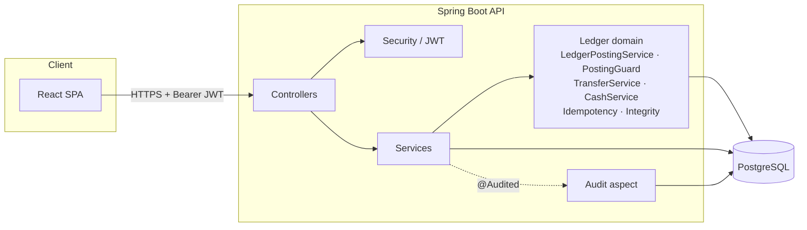
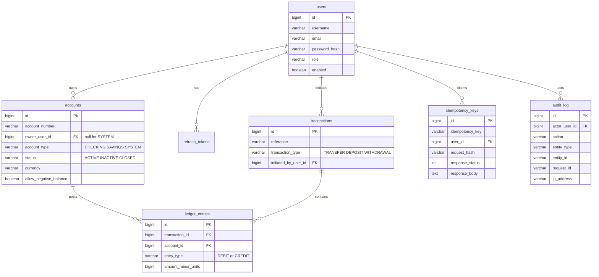

# Penny

A production-oriented, double-entry transaction ledger for digital banking. The
core problem this project solves is **correct money movement**, not account
management — every transfer is modeled the way a real bank's core ledger
models it: as a balanced pair of debit and credit postings to an append-only
ledger, with balances that are always *derived*, never stored.

Built as a portfolio-grade demonstration of backend engineering for financial
systems: correctness under concurrency, transactional idempotency, an
immutable audit trail, and role-based access control, all backed by real
integration tests against PostgreSQL (no H2, no mocked database).

---

## Table of contents

- [Why this project exists](#why-this-project-exists)
- [Architecture](#architecture)
- [Tech stack](#tech-stack)
- [Folder structure](#folder-structure)
- [Database schema](#database-schema)
- [Core correctness guarantees](#core-correctness-guarantees)
- [API examples](#api-examples)
- [Running locally](#running-locally)
- [Docker](#docker)
- [Design system](#design-system)
- [Testing](#testing)
- [CI/CD](#cicd)
- [Deployment](#deployment)
- [Screenshots](#screenshots)
- [Future improvements](#future-improvements)

---

## Why this project exists

Most portfolio banking apps are CRUD wrappers around an `accounts` table with
a `balance` column that gets mutated in place. That approach cannot answer
the question a real bank must always be able to answer: *prove that no money
was created or destroyed.*

Penny is built around the opposite constraint: **accounts never carry a
balance column at all.** A balance is always `SUM(credits) - SUM(debits)`
over an append-only ledger, computed by a database view. Every posting writes
exactly one debit and one credit of equal amount in a single transaction, so
the invariant `total debits == total credits` holds by construction, not by a
nightly reconciliation job.

That applies to money *entering* the system too. A deposit is not a one-sided
credit — it debits a bank-owned cash vault and credits the customer, because
double-entry forbids a posting with a single leg. That choice buys a stronger,
directly checkable property: **the sum of every account balance in the system
is always exactly zero**, which is what makes "was money created anywhere?"
answerable with one query. `GET /ledger/integrity` asserts it.

## Architecture

Clean/hexagonal layering — controllers hold no business logic, services own
authorization and orchestration, the ledger package owns the one piece of
the domain that must never be wrong.



**Layers**

| Package | Responsibility |
|---|---|
| `controller` | HTTP boundary only — binds requests, delegates, maps responses. No `if (role == ...)` here. |
| `service` | Business orchestration for users/accounts; owns `@PreAuthorize` role checks. |
| `ledger` | The double-entry domain: `LedgerPostingService` (the only writer of ledger entries), `PostingGuard` (locking + the preconditions every posting shares), `TransferService`, `CashService` (deposits/withdrawals), `IdempotencyService` + `IdempotencyClaimStore`, `TransactionHistoryService`, `LedgerIntegrityService`. |
| `domain` | Immutable Spring Data JDBC records — no anemic setters, no Hibernate magic. |
| `security` | JWT issuance/validation, `UserPrincipal`, `AccountAccessGuard` (ownership checks used in `@PreAuthorize` SpEL). |
| `audit` | `@Audited` annotation + one AOP aspect that writes `audit_log` rows — declarative, not scattered through services. |
| `dto` / `mapper` | Request/response shapes and domain↔DTO translation. |
| `exception` | Typed domain exceptions, each owning its HTTP status, plus a global handler for a consistent error contract. |
| `repository` | Spring Data JDBC repositories — thin, no query logic beyond what SQL/derived-query naming expresses. |

## Tech stack

**Backend** — Java 17 · Spring Boot 3 · Spring Web · Spring Security · Spring
Validation · Spring Data JDBC (not JPA/Hibernate) · PostgreSQL · Flyway · JWT
· springdoc-openapi (Swagger UI) · Docker

**Frontend** — React 19 · TypeScript · Vite · Tailwind CSS v4 · Axios ·
React Router · SF Pro (system font), light appearance only

**Testing** — JUnit 5 · MockMvc · Testcontainers (real PostgreSQL, no H2) ·
Mockito · JaCoCo (85% coverage gate)

**Deployment** — Backend: Render/Fly.io · Database: Neon PostgreSQL ·
Frontend: Netlify · CI/CD: GitHub Actions

## Folder structure

```
penny/
├── backend/
│   ├── src/main/java/com/penny/
│   │   ├── audit/          # @Audited annotation + AOP aspect, RequestIdFilter
│   │   ├── config/         # SecurityConfig, OpenApiConfig, property binding
│   │   ├── controller/     # REST controllers (thin)
│   │   ├── domain/         # Immutable records: User, Account, LedgerEntry, ...
│   │   ├── dto/             # Request/response DTOs
│   │   ├── exception/      # Typed exceptions + GlobalExceptionHandler
│   │   ├── ledger/          # Double-entry domain: posting, locking, cash, idempotency, integrity
│   │   ├── mapper/          # Domain <-> DTO mapping
│   │   ├── repository/     # Spring Data JDBC repositories
│   │   ├── security/        # JWT, filters, UserPrincipal, AccountAccessGuard
│   │   └── service/         # UserService, AccountService, AuthService
│   ├── src/main/resources/db/migration/  # Flyway migrations V1-V6
│   └── src/test/java/com/penny/     # Unit + Testcontainers integration tests
├── frontend/
│   └── src/
│       ├── api/             # axios client, JWT refresh interceptor, endpoints, types
│       ├── auth/             # AuthContext, route guards
│       ├── components/ui/   # Design-system primitives (DataTable, Button, Field, Overlay...)
│       ├── lib/              # Money parsing + formatting, useAsync, cn
│       └── pages/            # Login, Overview, Accounts, Transactions, Transfer, People, Audit
├── scripts/seed-demo.sh      # Seeds demo data through the public API (no SQL)
├── .github/workflows/ci.yml
├── docker-compose.yml
└── README.md
```

## Database schema



`account_balances` is a **database view**, not a table:

```sql
CREATE VIEW account_balances AS
SELECT
    a.id AS account_id,
    a.account_number,
    COALESCE(SUM(CASE WHEN le.entry_type = 'CREDIT' THEN le.amount_minor_units ELSE 0 END), 0)
        - COALESCE(SUM(CASE WHEN le.entry_type = 'DEBIT' THEN le.amount_minor_units ELSE 0 END), 0)
        AS balance_minor_units
FROM accounts a
LEFT JOIN ledger_entries le ON le.account_id = a.id
GROUP BY a.id, a.account_number;
```

`ledger_entries` and `audit_log` are append-only **at the database level** —
`BEFORE UPDATE`/`BEFORE DELETE` triggers reject any mutation, regardless of
whether it comes from application code, a migration, or a human at a `psql`
prompt.

Money is always `BIGINT` minor units (cents/paise) — never `float`/`double`.

## Core correctness guarantees

| Guarantee | How it's enforced |
|---|---|
| Debits always equal credits | `LedgerPostingService.post()` is the only method that writes `ledger_entries`, and it always writes one DEBIT + one CREDIT of equal amount in one DB transaction. |
| Balances can't drift from postings | `account_balances` is a view — there is no mutable balance column to fall out of sync. |
| No double-spend under concurrency | Both accounts are locked with `SELECT ... FOR UPDATE`, always in ascending account-id order (to prevent deadlocks between opposite-direction transfers), before the balance is re-read. Proven by `ConcurrentTransferIT`: 50 parallel transfers against an account that can only afford 10 — exactly 10 succeed, balance lands at exactly 0. |
| A request retried with the same `Idempotency-Key` never moves money twice | The key claim runs on a Postgres **SAVEPOINT** (`Propagation.NESTED`) inside the transfer's own transaction — the claim and the ledger postings commit or roll back together atomically. |
| The ledger can't be edited or deleted after the fact | `ledger_entries` and `audit_log` reject `UPDATE`/`DELETE` via DB triggers. |
| Every state-changing action is attributable | `@Audited` + one AOP aspect records actor, action, entity, request ID, and IP for every write, in the same transaction as the change. |
| Money cannot be created or destroyed | Deposits and withdrawals post against a bank-owned cash vault rather than crediting an account from nothing, so every account balance summed together is exactly zero. `GET /ledger/integrity` re-derives the totals straight from `ledger_entries` (not the balances view, so it is a genuine cross-check) and asserts it. |
| A customer cannot mint balance via the vault | Transfers explicitly reject system accounts. The vault is permitted to run negative; without that guard a customer could "transfer" from it. |
| A closed account cannot strand funds | Closing is terminal and is refused while the account still holds a balance. |

## API examples

All endpoints are documented interactively at `/swagger-ui.html` once the
backend is running. A few representative calls:

**Login**

```bash
curl -X POST http://localhost:8080/auth/login \
  -H 'Content-Type: application/json' \
  -d '{"username": "admin", "password": "Admin@12345"}'
```

```json
{
  "accessToken": "eyJhbGciOi...",
  "refreshToken": "sxp8Ly8Yov5...",
  "expiresInSeconds": 900,
  "tokenType": "Bearer"
}
```

**Transfer money (idempotent)**

```bash
curl -X POST http://localhost:8080/transfers \
  -H "Authorization: Bearer $ACCESS_TOKEN" \
  -H "Idempotency-Key: 6c1f9e2a-8b2e-4b7a-9a0e-4a2f1e2b3c4d" \
  -H 'Content-Type: application/json' \
  -d '{
        "sourceAccountId": 1,
        "destinationAccountId": 2,
        "amountMinorUnits": 5000,
        "reference": "July rent"
      }'
```

```json
{
  "transactionId": 42,
  "sourceAccountId": 1,
  "destinationAccountId": 2,
  "amountMinorUnits": 5000,
  "reference": "July rent",
  "createdAt": "2026-07-28T12:00:00Z"
}
```

Replaying the exact same request with the same `Idempotency-Key` returns the
same response body without posting a second pair of ledger entries. The same
key with a *different* payload is rejected with `409 Conflict`.

**Deposit cash (staff only)**

Money entering the ledger still posts two legs — the vault is debited, the
customer credited.

```bash
curl -X POST http://localhost:8080/accounts/2/deposit \
  -H "Authorization: Bearer $ACCESS_TOKEN" \
  -H "Idempotency-Key: $(uuidgen)" \
  -H 'Content-Type: application/json' \
  -d '{"amountMinorUnits": 25000, "reference": "Counter deposit"}'
```

```json
{
  "transactionId": 8,
  "transactionType": "DEPOSIT",
  "accountId": 2,
  "amountMinorUnits": 25000,
  "resultingBalanceMinorUnits": 389575,
  "reference": "Counter deposit",
  "createdAt": "2026-08-25T10:41:12Z"
}
```

**Prove the books balance**

```bash
curl http://localhost:8080/ledger/integrity -H "Authorization: Bearer $ACCESS_TOKEN"
```

```json
{
  "balanced": true,
  "totalDebitsMinorUnits": 2109575,
  "totalCreditsMinorUnits": 2109575,
  "netAcrossAllAccountsMinorUnits": 0,
  "ledgerEntryCount": 16
}
```

`netAcrossAllAccountsMinorUnits` is zero because the vault holds the exact
negative of everything on deposit. If a balance were ever conjured without a
matching debit, this would be non-zero.

**Filtered, sorted, paged transaction history**

A CUSTOMER's results are narrowed in SQL to transactions touching their own
accounts, so pages stay full and totals do not leak other customers' activity.

```bash
curl "http://localhost:8080/transfers?q=coffee&type=TRANSFER&type=DEPOSIT&minAmount=1000&sort=AMOUNT&direction=ASC&page=0&size=50" \
  -H "Authorization: Bearer $ACCESS_TOKEN"
```

Filters are `q` (reference search), `type` (repeatable), `from`/`to`,
`minAmount`/`maxAmount`, `accountId`, plus `sort` (`DATE`|`AMOUNT`) and
`direction`. Every filter applies to the count as well as the page, so
`totalItems` describes the whole matching set rather than what happened to load
— a filter that only narrows the visible page answers the question wrongly
instead of declining to answer it.

Two details worth naming. The multi-select `type` filter is why these queries
are assembled with `NamedParameterJdbcTemplate` rather than the usual
`(:x IS NULL OR col = :x)` pattern: `IN (:list)` generates invalid SQL for an
empty list, and `ORDER BY` cannot be parameter-bound at all. `sort` is a
whitelisted enum, so an unrecognised value is rejected at the edge with a 400
naming the accepted values and never reaches the SQL builder. And one private
`where(...)` helper feeds both the page query and its count query, so a filter
cannot apply to one and not the other.

**Filtered, paged audit trail**

```bash
curl "http://localhost:8080/audit?action=TRANSFER&entityType=Transaction&actorUserId=2&page=0&size=50" \
  -H "Authorization: Bearer $ACCESS_TOKEN"
```

This previously returned the entire table on every request. `audit_log` is
append-only and grows with every login, account opening, status change and
money movement, so it never shrinks — unbounded was only survivable while the
dataset was small.

**Freeze or close an account (ADMIN only)**

```bash
curl -X PATCH http://localhost:8080/accounts/2/status \
  -H "Authorization: Bearer $ACCESS_TOKEN" \
  -H 'Content-Type: application/json' \
  -d '{"status": "INACTIVE"}'
```

`CLOSED` is terminal, and closing is refused while the account still holds a
balance — otherwise the funds would be stranded on the books but unreachable.

**An account's statement, with a running balance**

```bash
curl "http://localhost:8080/ledger/1?page=0&size=50" -H "Authorization: Bearer $ACCESS_TOKEN"
```

Each entry carries `runningBalanceMinorUnits` — the account's balance
immediately after that posting. Without it a statement is just a list of
movements, and answering "what was the balance on the 14th" means adding them
up by hand.

The balance is accumulated by a window function over the account's **full**
history in a subquery, with `LIMIT`/`OFFSET` applied outside it:

```sql
WITH ordered AS (
  SELECT le.*,
         SUM(CASE WHEN le.entry_type = 'CREDIT' THEN le.amount_minor_units
                  ELSE -le.amount_minor_units END)
           OVER (ORDER BY le.created_at, le.id
                 ROWS BETWEEN UNBOUNDED PRECEDING AND CURRENT ROW) AS running_balance
  FROM ledger_entries le WHERE le.account_id = :accountId
)
SELECT * FROM ordered ORDER BY created_at DESC, id DESC LIMIT :size OFFSET :offset;
```

The obvious implementation — paginate first, then accumulate — is wrong, and
wrong in the way that ships. Both versions agree on page one, because page one
happens to start at the beginning of history either way; they diverge from page
two onward. Measured against the live database, the naive form reported
**−107,500** for a row whose true balance is **372,500**. `AccountLedgerIT`
asserts page two specifically, for exactly that reason.

**Both legs of one transaction**

```bash
curl http://localhost:8080/ledger/transaction/8 -H "Authorization: Bearer $ACCESS_TOKEN"
```

Returns the debit and the credit. `runningBalanceMinorUnits` is `null` here
rather than zero — the two legs sit on different accounts and share no
meaningful running total, and returning zero would read as "the balance is nil"
instead of "not applicable".

## Running locally

### Prerequisites

- Java 17+ (JaCoCo's bundled ASM does not yet support class files from
  JDKs newer than ~22 — if `mvn verify` fails with an
  `IllegalArgumentException: Unsupported class file major version`, point
  `JAVA_HOME` at a JDK in the 17–22 range)
- Node 20+
- Docker (for PostgreSQL, or the full stack)

> If you already run PostgreSQL locally it will occupy port 5432 and silently
> shadow the container, surfacing as a confusing `role "penny" does not
> exist`. Start the stack on another port instead:
> `POSTGRES_HOST_PORT=5433 docker compose up -d postgres`, and point the app at
> it with `DB_URL=jdbc:postgresql://localhost:5433/penny`.

### Backend

```bash
docker compose up -d postgres
cd backend
mvn spring-boot:run
```

The API is now at `http://localhost:8080`, Swagger UI at
`http://localhost:8080/swagger-ui.html`. Flyway migrates the schema
automatically on startup — there is no manual migration step.

### Frontend

```bash
cd frontend
cp .env.example .env.local
npm install
npm run dev
```

The app is now at `http://localhost:5173`.

### Seeding demo data

There is no public registration endpoint — in a bank, accounts are not
self-service. One script sets up everything else:

```bash
./scripts/seed-demo.sh
```

It creates a teller, an auditor and two customers, opens their accounts, funds
them, posts a few transfers, and finishes by asserting the ledger balances.
Every step goes through the public API, including the opening balances, which
are posted as real deposits against the cash vault. **There is deliberately no
SQL in it** — hand-inserting a balance produces a single-legged credit that
creates money from nothing, which `GET /ledger/integrity` will then correctly
report as unbalanced.

The one exception is the very first admin row, since creating a user requires
already being an admin.

Sign in with any of:

| Username | Password | Sees |
|---|---|---|
| `admin` | `Admin@12345` | Everything, including account status and user management |
| `tom_teller` | `Password123!` | Opens accounts, moves money, records cash |
| `amy_auditor` | `Password123!` | Read-only, including the audit trail |
| `jane_customer` | `Password123!` | Only her own accounts and transfers |

## Docker

The full stack — Postgres, backend, frontend — starts with one command:

```bash
docker compose up --build
```

- Frontend: `http://localhost:5173`
- Backend: `http://localhost:8080`
- Postgres: `localhost:5432`

Each service has a health check; `docker compose ps` shows readiness.

## Design system

Penny is an instrument of record, and the interface is built to read like one:
quiet, dense, precise. Hierarchy comes from alignment, rules, weight and
spacing — not from cards, shadows, gradients or coloured circles. **Light
appearance only.** Tokens live in `frontend/src/index.css`; primitives in
`frontend/src/components/ui/`.

Three commitments carry most of the weight:

- **13px is the workhorse size.** Not 15, not 17. A ledger row is meaningful
  mostly by comparison with the rows around it, and comparison is a function of
  how many rows fit in one eye movement.
- **Ink is the primary action colour; blue means links and focus, nothing
  else.** A saturated blue button on every screen is the loudest signal that an
  interface was assembled rather than designed. Colour is information here:
  four hues, one meaning each.
- **Nothing has a radius above 8px, and only floating surfaces cast a shadow.**
  Content surfaces get a border instead. Radii are 4 (inputs, badges), 6
  (buttons, surfaces) and 8 (drawers, modals).

And the decision that surprises people:

- **Outgoing money is ink, not red.** A debit is the most ordinary event in a
  ledger. Colouring every one of them red makes a normal day's activity look
  like a page of errors, and leaves nothing to say when something genuinely is
  wrong. Red is reserved for failures and negative balances.

Structurally:

- **One table grammar for everything.** Transactions, an account's statement,
  accounts, people and the audit trail all render through `DataTable`, so
  learning to read one teaches all five. It is a real `<table>`, not a grid of
  divs — a grid looks identical and tells assistive technology nothing about
  which header a cell belongs to.
- **Fixed vertical rhythm.** Top bar 52px, toolbar 44px, table header 36px,
  row 40px. The frame lands in the same place on every page so the eye can stop
  re-finding it.
- **Width follows content type.** Tables fill the viewport up to 1600px; forms
  and prose cap at 600px. One `max-w-3xl` for both is how a six-column audit
  table and a single-field form end up allotted identical space.
- **The sidebar has three states**: 232px with labels at ≥1280, a 56px icon
  rail at 1024–1279, and a drawer below that. Below 768 tables restructure into
  stacked rows rather than scrolling sideways.
- **Explicit pagination, never infinite scroll.** An auditor needs "1–50 of
  3,214" and a position they can return to; infinite scroll destroys both and
  breaks the browser's back button.
- **The detail drawer is deliberately non-modal.** Opening a transaction must
  not cost you your place in the list, so arrow keys keep stepping through rows
  while it is open and the drawer follows. Modals — which do trap focus and
  lock the page — are kept for the two cases that deserve interruption:
  confirming something irreversible, and a short creation form.
- **The invariant is ambient.** "Books balanced" sits in the sidebar footer on
  every screen for the roles allowed to read it, quiet while it is true. The
  full figures live on the audit page, where someone has come to check rather
  than to be reassured.

### Keyboard

The transaction table is fully operable without a mouse. `/` focuses search,
`↑`/`↓` and `j`/`k` step through rows, `Home`/`End` jump to the ends, `Enter`
opens the detail drawer and `Escape` closes it and restores focus. Focus is real
DOM focus on the row element rather than a rendered highlight, so the browser
scrolls it into view and screen readers announce it. A roving `tabindex` keeps
the whole table one tab stop instead of hundreds.

### Contrast

Every foreground/background pair is measured in-browser rather than assumed —
walking the DOM of each page, resolving the composited background behind each
text node, and checking the ratio against the threshold for that text's actual
size and weight. Every page passes WCAG AA with a floor of **4.75:1**.

| Token | On sunken `#F6F6F4` | Role |
|---|---|---|
| `--ink` `#1A1A17` | 16.5 | Primary text, primary button fill |
| `--ink-2` `#57574F` | 6.9 | Secondary text |
| `--ink-3` `#6E6E66` | 4.8 | Column headers, timestamps |
| `--blue` `#1D4ED8` | 6.2 | Links and focus only |
| `--positive` `#0F7A3D` | 5.2 | Money in |
| `--negative` `#B42318` | 6.3 | Errors, negative balances |
| `--warning` `#8A5A00` | 5.7 | Frozen, needs attention |
| white on `--ink` | 17.4 | Primary button |

Two notes on how that table came to be. `--ink-3` started at `#8A8A82`, which
measures **3.21:1** on the sunken background — acceptable for a 24px heading and
a genuine failure for the 11px column headers it was actually meant for. It was
darkened until it cleared 4.5:1 at that size. And `--ink-faint` `#A8A8A0` is
deliberately *below* AA: it is restricted to non-text marks — disabled glyphs,
placeholder dashes, empty-state rules — and never carries a word the reader
needs.

Beyond colour: `:focus-visible` is a crisp 2px ring defined globally, focus is
trapped and restored in modals and restored on drawer close, and
`prefers-reduced-motion` and `prefers-contrast` each have real handling rather
than being ignored. Reduced motion drops travel, not feedback — a drawer still
appears, it just does not slide.

## Testing

```bash
cd backend
mvn verify
```

This runs unit tests, Testcontainers-backed integration tests (a real
PostgreSQL container per test run — no H2), generates a JaCoCo coverage
report at `target/site/jacoco/index.html`, and enforces an 85% instruction
coverage gate.

43 tests, 92% instruction coverage. Notable ones:

- `ConcurrentTransferIT` — 50 concurrent transfers proving the pessimistic
  lock closes the double-spend race: exactly 10 succeed against a balance that
  affords 10, and the account lands on exactly zero
- `CashOperationsIT` — deposits and withdrawals, including an assertion that
  the ledger still balances afterwards
- `IdempotencyIT` — replay-safety, cross-payload conflict detection, and that a
  *failed* operation releases its key for a legitimate retry
- `AccountLifecycleIT` — status transitions, that a frozen account rejects
  transfers, that closing is terminal, and that an account holding money cannot
  be closed
- `TransactionHistoryIT` — paging plus the SQL-level access filter, including
  that one customer cannot page through another's activity
- `AuthControllerIT`, `AccountControllerIT`, `TransferControllerIT`,
  `AuditControllerIT`, `UserControllerIT` — MockMvc + Testcontainers,
  exercising the full filter chain including JWT auth and role checks

Test fixtures fund accounts through the real deposit endpoint rather than
inserting ledger rows. An earlier version seeded balances with a lone CREDIT,
which creates money from nothing — the tests were asserting against a state the
production code could never actually produce.

## CI/CD

`.github/workflows/ci.yml` runs on every pull request and push to `main`:

1. **Backend** — `mvn verify` (build, unit + integration tests, coverage report), uploads JaCoCo + surefire/failsafe reports as artifacts
2. **Frontend** — type-check, build, lint
3. **Docker** — builds both images to catch Dockerfile regressions, gated on the first two jobs passing

## Deployment

| Component | Target | Notes |
|---|---|---|
| Backend | Render or Fly.io | Deploy the `backend/Dockerfile` image; set `DB_URL`, `DB_USERNAME`, `DB_PASSWORD`, `JWT_SECRET` as environment variables. |
| Database | [Neon](https://neon.tech) PostgreSQL | Serverless Postgres; Flyway migrates on backend startup, no manual step. |
| Frontend | Netlify | Build command `npm run build`, publish directory `dist`, set `VITE_API_BASE_URL` to the deployed backend URL. |

## Screenshots

> _Placeholder — add screenshots of the Dashboard, Transfer flow, Ledger
> viewer, and Audit log here before sharing publicly._

## Future improvements

- **Refresh tokens in an httpOnly cookie.** They currently live in
  `localStorage` on the frontend for demo simplicity — readable by any
  script on the page. A production deployment should move the refresh
  token to an httpOnly, `SameSite=Strict` cookie and keep only the access
  token in memory.
- **Multi-currency transfers with FX conversion.** An account carries a
  currency, but a transfer currently assumes both sides match and does not
  enforce it — cross-currency movement needs a rate-locking step recorded on
  the transaction, and until that exists the API should reject mismatched
  pairs outright.
- **Pagination on the audit log and account list.** Transaction history is
  paged; those two still return everything.
- **Outbox pattern for downstream events.** Publishing `TransferCompleted`
  events (e.g. to notify a fraud-detection service) reliably would need an
  outbox table written in the same transaction as the ledger entries.
- **Rate limiting** on `/auth/login` and `/transfers` to blunt brute-force
  and abuse.
- **Scheduled reconciliation.** `GET /ledger/integrity` performs this check on
  demand; running it on a schedule and alerting on failure would catch drift
  without someone having to look.
- **OpenTelemetry tracing** across the request → service → DB path, since
  `request_id` is already threaded through the audit log and would pair
  naturally with a trace ID.
