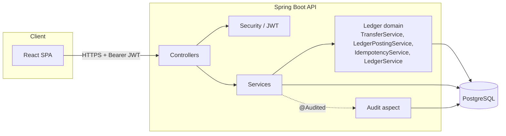
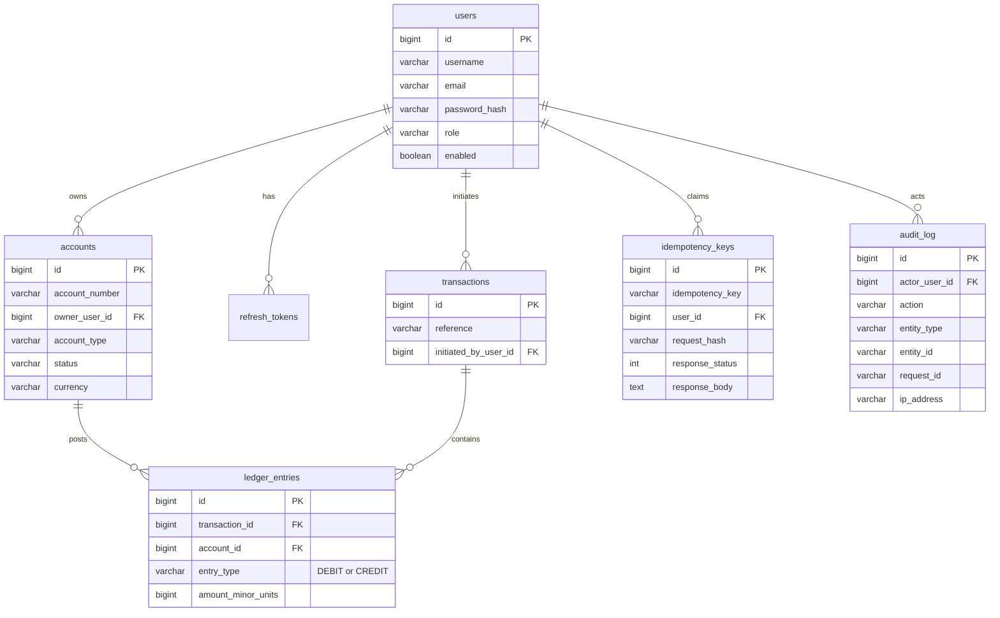

# LedgerLite

A production-oriented, double-entry transaction ledger for digital banking. The
core problem this project solves is **correct money movement**, not account
management — every transfer is modeled the way a real bank's core ledger
models it: as a balanced pair of debit and credit postings to an append-only
ledger, with balances that are always *derived*, never stored.

Built as a portfolio-grade demonstration of backend engineering for financial
systems: correctness under concurrency, transactional idempotency, an
immutable audit trail, and role-based access control, all backed by real
integration tests against PostgreSQL (no H2, no mocked database).

---

## Table of contents

- [Why this project exists](#why-this-project-exists)
- [Architecture](#architecture)
- [Tech stack](#tech-stack)
- [Folder structure](#folder-structure)
- [Database schema](#database-schema)
- [Core correctness guarantees](#core-correctness-guarantees)
- [API examples](#api-examples)
- [Running locally](#running-locally)
- [Docker](#docker)
- [Testing](#testing)
- [CI/CD](#cicd)
- [Deployment](#deployment)
- [Screenshots](#screenshots)
- [Future improvements](#future-improvements)

---

## Why this project exists

Most portfolio banking apps are CRUD wrappers around an `accounts` table with
a `balance` column that gets mutated in place. That approach cannot answer
the question a real bank must always be able to answer: *prove that no money
was created or destroyed.*

LedgerLite is built around the opposite constraint: **accounts never carry a
balance column at all.** A balance is always `SUM(credits) - SUM(debits)`
over an append-only ledger, computed by a database view. Every transfer posts
exactly one debit and one credit of equal amount in a single transaction, so
the invariant `total debits == total credits` holds by construction, not by a
nightly reconciliation job.

## Architecture

Clean/hexagonal layering — controllers hold no business logic, services own
authorization and orchestration, the ledger package owns the one piece of
the domain that must never be wrong.



**Layers**

| Package | Responsibility |
|---|---|
| `controller` | HTTP boundary only — binds requests, delegates, maps responses. No `if (role == ...)` here. |
| `service` | Business orchestration for users/accounts; owns `@PreAuthorize` role checks. |
| `ledger` | The double-entry domain: `TransferService` (validation + locking), `LedgerPostingService` (the only writer of ledger entries), `IdempotencyService`, `LedgerService` (balance/history reads). |
| `domain` | Immutable Spring Data JDBC records — no anemic setters, no Hibernate magic. |
| `security` | JWT issuance/validation, `UserPrincipal`, `AccountAccessGuard` (ownership checks used in `@PreAuthorize` SpEL). |
| `audit` | `@Audited` annotation + one AOP aspect that writes `audit_log` rows — declarative, not scattered through services. |
| `dto` / `mapper` | Request/response shapes and domain↔DTO translation. |
| `exception` | Typed domain exceptions, each owning its HTTP status, plus a global handler for a consistent error contract. |
| `repository` | Spring Data JDBC repositories — thin, no query logic beyond what SQL/derived-query naming expresses. |

## Tech stack

**Backend** — Java 17 · Spring Boot 3 · Spring Web · Spring Security · Spring
Validation · Spring Data JDBC (not JPA/Hibernate) · PostgreSQL · Flyway · JWT
· springdoc-openapi (Swagger UI) · Docker

**Frontend** — React 19 · TypeScript · Vite · Tailwind CSS v4 · Axios ·
React Router

**Testing** — JUnit 5 · MockMvc · Testcontainers (real PostgreSQL, no H2) ·
Mockito · JaCoCo (85% coverage gate)

**Deployment** — Backend: Render/Fly.io · Database: Neon PostgreSQL ·
Frontend: Netlify · CI/CD: GitHub Actions

## Folder structure

```
ledgerLite/
├── backend/
│   ├── src/main/java/com/ledgerlite/
│   │   ├── audit/          # @Audited annotation + AOP aspect, RequestIdFilter
│   │   ├── config/         # SecurityConfig, OpenApiConfig, property binding
│   │   ├── controller/     # REST controllers (thin)
│   │   ├── domain/         # Immutable records: User, Account, LedgerEntry, ...
│   │   ├── dto/             # Request/response DTOs
│   │   ├── exception/      # Typed exceptions + GlobalExceptionHandler
│   │   ├── ledger/          # Double-entry domain: TransferService, LedgerPostingService, IdempotencyService
│   │   ├── mapper/          # Domain <-> DTO mapping
│   │   ├── repository/     # Spring Data JDBC repositories
│   │   ├── security/        # JWT, filters, UserPrincipal, AccountAccessGuard
│   │   └── service/         # UserService, AccountService, AuthService
│   ├── src/main/resources/db/migration/  # Flyway migrations V1-V5
│   └── src/test/java/com/ledgerlite/     # Unit + Testcontainers integration tests
├── frontend/
│   └── src/
│       ├── api/             # axios client, JWT refresh interceptor, endpoints, types
│       ├── auth/             # AuthContext, route guards
│       ├── components/      # Shared UI primitives
│       ├── lib/               # Money/date formatting
│       └── pages/            # Login, Dashboard, Accounts, Transfer, Audit, ...
├── .github/workflows/ci.yml
├── docker-compose.yml
└── README.md
```

## Database schema



`account_balances` is a **database view**, not a table:

```sql
CREATE VIEW account_balances AS
SELECT
    a.id AS account_id,
    a.account_number,
    COALESCE(SUM(CASE WHEN le.entry_type = 'CREDIT' THEN le.amount_minor_units ELSE 0 END), 0)
        - COALESCE(SUM(CASE WHEN le.entry_type = 'DEBIT' THEN le.amount_minor_units ELSE 0 END), 0)
        AS balance_minor_units
FROM accounts a
LEFT JOIN ledger_entries le ON le.account_id = a.id
GROUP BY a.id, a.account_number;
```

`ledger_entries` and `audit_log` are append-only **at the database level** —
`BEFORE UPDATE`/`BEFORE DELETE` triggers reject any mutation, regardless of
whether it comes from application code, a migration, or a human at a `psql`
prompt.

Money is always `BIGINT` minor units (cents/paise) — never `float`/`double`.

## Core correctness guarantees

| Guarantee | How it's enforced |
|---|---|
| Debits always equal credits | `LedgerPostingService.post()` is the only method that writes `ledger_entries`, and it always writes one DEBIT + one CREDIT of equal amount in one DB transaction. |
| Balances can't drift from postings | `account_balances` is a view — there is no mutable balance column to fall out of sync. |
| No double-spend under concurrency | Both accounts are locked with `SELECT ... FOR UPDATE`, always in ascending account-id order (to prevent deadlocks between opposite-direction transfers), before the balance is re-read. Proven by `ConcurrentTransferIT`: 50 parallel transfers against an account that can only afford 10 — exactly 10 succeed, balance lands at exactly 0. |
| A request retried with the same `Idempotency-Key` never moves money twice | The key claim runs on a Postgres **SAVEPOINT** (`Propagation.NESTED`) inside the transfer's own transaction — the claim and the ledger postings commit or roll back together atomically. |
| The ledger can't be edited or deleted after the fact | `ledger_entries` and `audit_log` reject `UPDATE`/`DELETE` via DB triggers. |
| Every state-changing action is attributable | `@Audited` + one AOP aspect records actor, action, entity, request ID, and IP for every write, in the same transaction as the change. |

## API examples

All endpoints are documented interactively at `/swagger-ui.html` once the
backend is running. A few representative calls:

**Login**

```bash
curl -X POST http://localhost:8080/auth/login \
  -H 'Content-Type: application/json' \
  -d '{"username": "admin", "password": "Admin@12345"}'
```

```json
{
  "accessToken": "eyJhbGciOi...",
  "refreshToken": "sxp8Ly8Yov5...",
  "expiresInSeconds": 900,
  "tokenType": "Bearer"
}
```

**Transfer money (idempotent)**

```bash
curl -X POST http://localhost:8080/transfers \
  -H "Authorization: Bearer $ACCESS_TOKEN" \
  -H "Idempotency-Key: 6c1f9e2a-8b2e-4b7a-9a0e-4a2f1e2b3c4d" \
  -H 'Content-Type: application/json' \
  -d '{
        "sourceAccountId": 1,
        "destinationAccountId": 2,
        "amountMinorUnits": 5000,
        "reference": "July rent"
      }'
```

```json
{
  "transactionId": 42,
  "sourceAccountId": 1,
  "destinationAccountId": 2,
  "amountMinorUnits": 5000,
  "reference": "July rent",
  "createdAt": "2026-07-28T12:00:00Z"
}
```

Replaying the exact same request with the same `Idempotency-Key` returns the
same response body without posting a second pair of ledger entries. The same
key with a *different* payload is rejected with `409 Conflict`.

**View an account's ledger**

```bash
curl http://localhost:8080/ledger/1 -H "Authorization: Bearer $ACCESS_TOKEN"
```

## Running locally

### Prerequisites

- Java 17+ (JaCoCo's bundled ASM does not yet support class files from
  JDKs newer than ~22 — if `mvn verify` fails with an
  `IllegalArgumentException: Unsupported class file major version`, point
  `JAVA_HOME` at a JDK in the 17–22 range)
- Node 20+
- Docker (for PostgreSQL, or the full stack)

### Backend

```bash
docker compose up -d postgres
cd backend
mvn spring-boot:run
```

The API is now at `http://localhost:8080`, Swagger UI at
`http://localhost:8080/swagger-ui.html`. Flyway migrates the schema
automatically on startup — there is no manual migration step.

### Frontend

```bash
cd frontend
cp .env.example .env.local
npm install
npm run dev
```

The app is now at `http://localhost:5173`.

### Bootstrapping your first user

There is no seed data or public registration endpoint (by design — in a
bank, accounts aren't self-service). Create the first ADMIN directly in the
database, then use the API to create everyone else:

```sql
-- password_hash below is a BCrypt hash; generate your own with
-- new BCryptPasswordEncoder().encode("your-password") or any BCrypt tool.
INSERT INTO users (username, email, password_hash, role)
VALUES ('admin', 'admin@ledgerlite.local', '<bcrypt-hash>', 'ADMIN');
```

From there, log in as `admin` and use `POST /users` (ADMIN/TELLER) to create
TELLER, CUSTOMER, and AUDITOR accounts, and `POST /accounts` to open bank
accounts for them.

## Docker

The full stack — Postgres, backend, frontend — starts with one command:

```bash
docker compose up --build
```

- Frontend: `http://localhost:5173`
- Backend: `http://localhost:8080`
- Postgres: `localhost:5432`

Each service has a health check; `docker compose ps` shows readiness.

## Testing

```bash
cd backend
mvn verify
```

This runs unit tests, Testcontainers-backed integration tests (a real
PostgreSQL container per test run — no H2), generates a JaCoCo coverage
report at `target/site/jacoco/index.html`, and enforces an 85% instruction
coverage gate.

Notable tests:

- `ConcurrentTransferIT` — 50 concurrent transfers proving the pessimistic
  lock closes the double-spend race
- `IdempotencyIT` — replay-safety and cross-payload conflict detection for
  `Idempotency-Key`
- `AuthControllerIT`, `AccountControllerIT`, `TransferControllerIT`,
  `AuditControllerIT`, `UserControllerIT` — MockMvc + Testcontainers,
  exercising the full filter chain including JWT auth and role checks

## CI/CD

`.github/workflows/ci.yml` runs on every pull request and push to `main`:

1. **Backend** — `mvn verify` (build, unit + integration tests, coverage report), uploads JaCoCo + surefire/failsafe reports as artifacts
2. **Frontend** — type-check, build, lint
3. **Docker** — builds both images to catch Dockerfile regressions, gated on the first two jobs passing

## Deployment

| Component | Target | Notes |
|---|---|---|
| Backend | Render or Fly.io | Deploy the `backend/Dockerfile` image; set `DB_URL`, `DB_USERNAME`, `DB_PASSWORD`, `JWT_SECRET` as environment variables. |
| Database | [Neon](https://neon.tech) PostgreSQL | Serverless Postgres; Flyway migrates on backend startup, no manual step. |
| Frontend | Netlify | Build command `npm run build`, publish directory `dist`, set `VITE_API_BASE_URL` to the deployed backend URL. |

## Screenshots

> _Placeholder — add screenshots of the Dashboard, Transfer flow, Ledger
> viewer, and Audit log here before sharing publicly._

## Future improvements

- **Refresh tokens in an httpOnly cookie.** They currently live in
  `localStorage` on the frontend for demo simplicity — readable by any
  script on the page. A production deployment should move the refresh
  token to an httpOnly, `SameSite=Strict` cookie and keep only the access
  token in memory.
- **Multi-currency transfers with FX conversion.** Currently a transfer
  assumes same-currency source and destination; cross-currency transfers
  would need a rate-locking step recorded on the transaction.
- **Outbox pattern for downstream events.** Publishing `TransferCompleted`
  events (e.g. to notify a fraud-detection service) reliably would need an
  outbox table written in the same transaction as the ledger entries.
- **Rate limiting** on `/auth/login` and `/transfers` to blunt brute-force
  and abuse.
- **Scheduled reconciliation job** that independently re-derives every
  account's balance from `ledger_entries` and alerts on any drift from the
  `account_balances` view, as a defense-in-depth check against a bug in the
  view itself.
- **OpenTelemetry tracing** across the request → service → DB path, since
  `request_id` is already threaded through the audit log and would pair
  naturally with a trace ID.
